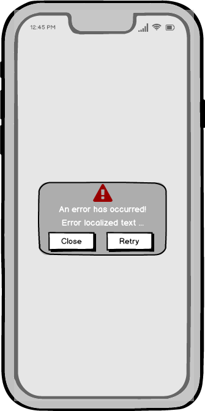

# Test Scenarios: "Error View (`DMErrorView`)"

## 0.0 The Mockup design

## 1. General Information
- **Module**: DMErrorView
- **Description**: A custom SwiftUI view that displays an error state with an image, error text, and optional action buttons. It uses a settings provider (`DMErrorViewSettings`) to configure its appearance.
- **Type of Tests**: Functional Tests (BDD), Unit Testing, Snapshot Testing.
- **Status**: ? / 🚧 / ❌ / ✅

---

## 2. Test Scenarios

### Scenario 1: ✅ Verify Default Initialization
- **Description**: Check if the `DMErrorView` is initialized correctly with default settings.
- **Steps**:
  - [✅] Create a new instance of `DMErrorView` with default settings (`DMErrorDefaultViewSettings`).
  - [✅] Verify that the error image is displayed as an exclamation mark triangle icon (probably: `exclamationmark.triangle`).
  - [✅] Verify that the error text is `"An error has occurred!"`.
  - [✅] Verify that the "Close" button is present.
  - [✅] Verify that the "Retry" button is absent when `onRetry` is not provided.
- **Expected Result**:
  - The view is initialized correctly with default settings.
  - The error image, text, and buttons match the expected behavior.
- **Status**: ? / 🚧 / ❌ / ✅

---

### Scenario 2: ✅ Verify Error Image Behavior
- **Description**: Check if the error image is styled correctly based on the `errorImageSettings`.
- **Steps**:
  - [✅] Create a new instance of `DMErrorView` with custom `errorImageSettings`.
  - [✅] Set the `image` to `Image(systemName: "xmark.octagon")`, `foregroundColor` to `.orange`, and `frameSize` to `CGSize(width: 60, height: 60)` and `alignment` to `.bottomTrailing`.
  - [✅] Verify that the error image is displayed with the correct image.
  - [✅] Verify that the foreground color is orange.
  - [✅] Verify that the frame size is 60x60.
  - [✅] Verify that the image alignment is `.bottomTrailing`.
- **Expected Result**:
  - The error image is styled correctly with the specified properties.
- **Status**: ? / 🚧 / ❌ / ✅

---

### Scenario 3: ✅ Verify Error Title Behavior
- **Description**: Check if the error text is styled correctly based on the `errorTextSettings`.
- **Steps**:
  - [✅] Create a new instance of `DMErrorView` with custom `errorTextSettings`.
  - [✅] Set the `errorText` to `"Oops! Something went wrong."`, `foregroundColor` to `.red`, and `multilineTextAlignment` to `.leading` and padding to `EdgeInsets(top: 11,leading: 16,bottom: 12,trailing: 17)`.
  - [✅] Verify that the error text is `"Oops! Something went wrong."`.
  - [✅] Verify that the foreground color is red.
  - [✅] Verify that the alignment is leading.
  - [✅] Verify that the padding is `EdgeInsets(top: 11,leading: 16,bottom: 12,trailing: 17)`.
- **Expected Result**:
  - The error text is styled correctly with the specified properties.
- **Status**: ? / 🚧 / ❌ / ✅

### Scenario 4: ✅ Verify Error Behavior
- **Description**: Check if the error is styled correctly based on the `errorTextSettings`.
- **Steps**:
  - [✅] Create a new instance of `DMErrorView` with custom `errorTextSettings`.
  - [✅] Set the `error` to `NSError(domain: "TestError", code: 1404, userInfo: [NSLocalizedDescriptionKey: "Something went wrong"])`.
  - [✅] Set the title `errorText` to `"Oops! Something went wrong."`, `foregroundColor` to `.red`, and `multilineTextAlignment` to `.leading` and padding to `EdgeInsets(top: 11,leading: 16,bottom: 12,trailing: 17)`.
  - [✅] Verify that the error text is `"Something went wrong"`.
  - [✅] Verify that the error text title is `"Oops! Something went wrong."`.
  - [✅] Verify that the foreground color is red.
  - [✅] Verify that the alignment is leading.
  - [✅] Verify that the padding is `EdgeInsets(top: 11,leading: 16,bottom: 12,trailing: 17)`.

- **Expected Result**:
  - The error and error description are styled correctly with the specified properties.
- **Status**: ? / 🚧 / ❌ / ✅

---

### Scenario 5: ✅ Verify Action Buttons Behavior
- **Description**: Check if the "Close" and "Retry" buttons are styled and behave correctly.
- **Steps**:
  - [✅] Create a new instance of `DMErrorView` with custom `actionButtonCloseSettings` and `actionButtonRetrySettings`.
  - [✅] Set the "Close" button text to `"Dismiss"` and the "Retry" button text to `"Try Again"`.
  - [✅] Verify that the "Close" button is present and styled correctly.
  - [✅] Verify that the "Retry" button is present and styled correctly when `onRetry` is provided.
  - [✅] Simulate a tap on the "Close" button and verify that the `onClose` action is triggered.
  - [✅] Simulate a tap on the "Retry" button and verify that the `onRetry` action is triggered.
- **Expected Result**:
  - The buttons are displayed and styled correctly.
  - The actions are triggered as expected.
- **Status**: ? / 🚧 / ❌ / ✅

---

### Scenario 6: ✅ Verify Snapshot Testing For DefaultSettings
- **Description**: Use snapshot testing to verify the visual appearance of the `DMErrorView`.
- **Steps**:
  - [✅] Create a new instance of `DMErrorView` with default settings.
  - [✅] Render the view using a snapshot testing library (e.g., `SnapshotTesting` or `XCTest`).
  - [✅] Compare the rendered view with a reference snapshot.
  - [✅] Verify that the snapshot matches the reference image.
- **Expected Result**:
  - The rendered view matches the reference snapshot.
  - If the test fails, update the snapshot only after verifying intentional UI changes.
- **Status**: ? / 🚧 / ❌ / ✅

### Scenario 7: ✅ Verify Snapshot Testing For CustomSettings
- **Description**: Use snapshot testing to verify the visual appearance of the `DMErrorView`.
- **Steps**:
  - [✅] Create a new instance of `DMErrorView` with custom settings.
  - [✅] Render the view using a snapshot testing library (e.g., `SnapshotTesting` or `XCTest`).
  - [✅] Compare the rendered view with a reference snapshot.
  - [✅] Verify that the snapshot matches the reference image.
- **Expected Result**:
  - The rendered view matches the reference snapshot.
  - If the test fails, update the snapshot only after verifying intentional UI changes.
- **Status**: ? / 🚧 / ❌ / ✅

---

## 3. Test Data
| Method               | Input Data                          | Expected Output                     |
|---------------------|--------------------------------------|------------------------------------------|
| Default Initialization | None                                | `DMErrorView` with default settings |
| Error Image          | Image: `"xmark.octagon"`, Foreground Color: `.orange`, Frame Size: `60x60` | Error image styled with specified properties |
| Error Text           | Text: `"Oops! Something went wrong."`, Foreground Color: `.black`, Alignment: `.leading` | Error text styled with specified properties |
| Action Buttons       | Close Button: `"Dismiss"`, Retry Button: `"Try Again"` | Buttons styled and functional as expected |
| Snapshot Testing     | Default Settings                   | Snapshot matches the reference image |

---

## 4. Notes
- Use snapshot testing to verify the visual appearance of `DMErrorView`.
  - Libraries like `SnapshotTesting` or `XCTest` can be used for this purpose.
  - Ensure that snapshots are updated only after verifying intentional UI changes.
- Use unit inspection to programmatically validate the styling and behavior.
- Ensure that all tests are performed on multiple devices and screen sizes to verify responsiveness.
- Localization testing should cover at least two languages (e.g., English and Ukrainian) if your app supports localization.

---

### Status Icons:
- `?`: Default status (not verified).
- `🚧`: In progress.
- `❌`: Test failed / issue detected.
- `✅`: Test successfully completed.