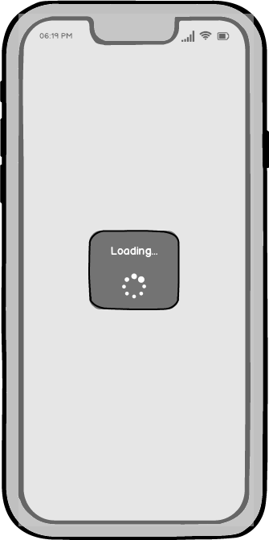

# Test Scenarios: "Loading View (`DMProgressView`)"

## 0.0 The Mockup design

## 1. General Information
- **Module**: DMProgressView
- **Description**: A custom SwiftUI view that displays a progress indicator with optional text. It uses a settings provider (`DMLoadingViewSettings`) to configure its appearance.
- **Type of Tests**: Functional Tests (BDD), Unit Testing, Snapshot Testing.
- **Status**: ? / 🚧 / ❌ / ✅

---

## 2. Test Scenarios

### Scenario 1: ✅ Verify Default Initialization
- **Description**: Check if the `DMProgressView` is initialized correctly with default settings.
- **Steps**:
  - [✅] Create a new instance of `DMProgressView` with default settings (`DMLoadingDefaultViewSettings`).
  - [✅] Verify that the DMProgressView is confirm to `View`.
  - [✅] Verify that the progress indicator and text are displayed.
  - [✅] Verify that the text is `"Loading..."`.
- **Expected Result**:
  - The view is initialized correctly with default settings.
  - The text `"Loading..."` is displayed.
- **Status**: ? / 🚧 / ❌ / ✅

---

### Scenario 2: ✅ Verify Progress Indicator Behavior
- **Description**: Check if the progress indicator is styled correctly based on the `progressIndicatorProperties`.
- **Steps**:
  - [✅] Create a new instance of `DMProgressView` with custom `progressIndicatorProperties`.
  - [✅] Set the `size` to `.small` and `tintColor` to `.green`.
  - [✅] Verify that the progress indicator size is small. -> Can't Verify directly due to `ViewInspector` doesn't provide how to read `controlSize` for iOS. Is verified via SnapshotTesting.
  - [✅] Verify that the tint color is green.
  - [✅] Verify that the style is `.circular`
- **Expected Result**:
  - The progress indicator is styled correctly with the specified size and tint color.
- **Status**: ? / 🚧 / ❌ / ✅

---

### Scenario 3: ✅ Verify Loading Text Behavior
- **Description**: Check if the loading text is styled correctly based on the `loadingTextProperties`.
- **Steps**:
  - [✅] Create a new instance of `DMProgressView` with custom `loadingTextProperties`.
  - [✅] Set the `text` to `"Please wait..."`, `foregroundColor` to `.red`, `lineLimit` to `1`, `linePadding` to `8` from `top:leading:bottom:trailing` and `font` to `.headline`.
  - [✅] Verify that the text is `"Please Wait..."`.
  - [✅] Verify that the text has the correct foreground color and font.
- **Expected Result**:
  - The text is styled correctly with the specified properties.
- **Status**: ? / 🚧 / ❌ / ✅

---

### Scenario 4: ? Verify Container Appearance
- **Description**: Check if the container view has the correct foreground color.
- **Steps**:
  - [?] Create a new instance of `DMProgressView` with a custom `loadingContainerForegroundColor`.
  - [?] Set the `loadingContainerForegroundColor` to `.blue`.
  - [?] Verify that the container view has a blue foreground color.
- **Expected Result**:
  - The container view has the correct foreground color.
- **Status**: ? / 🚧 / ❌ / ✅

---

### Scenario 5: ? Verify Geometry and Layout
- **Description**: Check if the layout adapts dynamically based on the `frameGeometrySize`.
- **Steps**:
  - [?] Create a new instance of `DMProgressView` with a custom `frameGeometrySize`.
  - [?] Set the `frameGeometrySize` to `CGSize(width: 400, height: 400)`.
  - [?] Verify that the layout adapts to the provided size.
- **Expected Result**:
  - The layout adapts dynamically to the provided geometry and constraints.
- **Status**: ? / 🚧 / ❌ / ✅

---

### Scenario 7: ? Verify Snapshot Testing
- **Description**: Use snapshot testing to verify the visual appearance of the `DMProgressView`.
- **Steps**:
  - [?] Create a new instance of `DMProgressView` with default and fully custom settings.
  - [?] Render the view using a snapshot testing library (e.g., `SnapshotTesting` or `XCTest`).
  - [?] Compare the rendered view with a reference snapshot.
  - [?] Verify that the snapshot matches the reference image.
- **Expected Result**:
  - The rendered view matches the reference snapshot.
  - If the test fails, update the reference snapshot after verifying the changes.
- **Status**: ? / 🚧 / ❌ / ✅

---

## 3. Test Data
| Method               | Input Data                          | Expected Output                     |
|---------------------|--------------------------------------|------------------------------------------|
| Default Initialization | None                                | `DMProgressView` with default settings |
| Progress Indicator   | Size: `.small`, Tint Color: `.green` | Progress indicator styled with small size and green tint |
| Loading Text         | Text: `"Please Wait..."`, Foreground Color: `.black`, Font: `.headline` | Text styled with specified properties |
| Container Appearance | Foreground Color: `.blue`           | Container view with blue foreground color |
| Geometry and Layout  | Frame Size: `CGSize(width: 400, height: 400)` | Layout adapts to the provided size |
| Snapshot Testing     | Default Settings                   | Snapshot matches the reference image |

---

## 4. Notes
- Use snapshot testing to verify the visual appearance of `DMProgressView`.
  - Libraries like `SnapshotTesting` or `XCTest` can be used for this purpose.
  - Ensure that snapshots are updated only after verifying intentional UI changes.
- Use unit inspection to programmatically validate the styling and layout.
- Ensure that all tests are performed on multiple devices and screen sizes to verify responsiveness.
- Localization testing should cover at least two languages (e.g., English and Ukrainian) if your app supports localization.

---

### Status Icons:
- `?`: Default status (not verified).
- `🚧`: In progress.
- `❌`: Test failed / issue detected.
- `✅`: Test successfully completed.